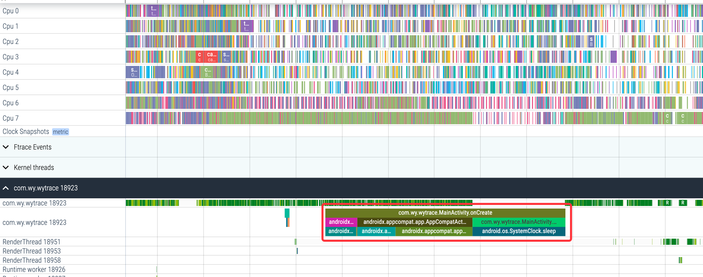

### 介绍
这是一个android 平台排查方法耗时的库

### 背景
排查一个方法耗时时，经常需要在内部打印各种时间戳,比如排查下面onCreate方法耗时
```java
   @Override
    protected void onCreate(Bundle savedInstanceState) {
        //步骤1
        super.onCreate(savedInstanceState);
        //步骤2
        setContentView(R.layout.activity_main);
        //步骤3
        test();
    }

```
### wytrace
这个库就是解决上面的繁琐问题
支持环境
Android 9 ～ Android 12 debug包

```groovy
allprojects {
    repositories {
        ...
        maven { url 'https://jitpack.io' }
    }
}
```

```groovy

android {
    buildFeatures {
        prefab true
    }
}

dependencies {
    implementation 'com.bytedance.android:shadowhook:1.0.7'
    implementation 'com.github.wuyouuuu:wytrace:1.0.0'
}
```


```java
/**
 *
 * @param methodName 方法名
 * @param tid   需要抓取trace线程tid   -1表示抓取全部线程
 * @param depth 方法内部抓取层级
 * @param debug 是否打印方法耗时日志
 */

public static void methodHookStart(String methodName, int tid, int depth, boolean debug){}

```
### 示例
```java
        ArtMethodTrace.methodHookStart("com.wy.wytrace.MainActivity.onCreate", Process.myTid(),3,true);

```
日志输出
```text
2023-06-26 18:26:39.288 18782-18782/com.wy.wytrace E/wytrace: 3, androidx.activity.ComponentActivity.onCreate 28 ms
2023-06-26 18:26:39.288 18782-18782/com.wy.wytrace E/wytrace: 3, androidx.lifecycle.LifecycleRegistry.handleLifecycleEvent 0 ms
2023-06-26 18:26:39.288 18782-18782/com.wy.wytrace E/wytrace: 3, androidx.fragment.app.FragmentController.dispatchCreate 0 ms
2023-06-26 18:26:39.288 18782-18782/com.wy.wytrace E/wytrace: 2, androidx.fragment.app.FragmentActivity.onCreate 28 ms
2023-06-26 18:26:39.323 18782-18782/com.wy.wytrace E/wytrace: 3, androidx.appcompat.app.AppCompatActivity.initViewTreeOwners 35 ms
2023-06-26 18:26:39.323 18782-18782/com.wy.wytrace E/wytrace: 3, androidx.appcompat.app.AppCompatActivity.getDelegate 0 ms
2023-06-26 18:26:39.386 18782-18782/com.wy.wytrace E/wytrace: 3, androidx.appcompat.app.AppCompatDelegateImpl.setContentView 63 ms
2023-06-26 18:26:39.386 18782-18782/com.wy.wytrace E/wytrace: 2, androidx.appcompat.app.AppCompatActivity.setContentView 98 ms
2023-06-26 18:26:39.486 18782-18782/com.wy.wytrace E/wytrace: 3, android.os.SystemClock.sleep 100 ms
2023-06-26 18:26:39.486 18782-18782/com.wy.wytrace E/wytrace: 2, com.wy.wytrace.MainActivity.test 100 ms
2023-06-26 18:26:39.486 18782-18782/com.wy.wytrace E/wytrace: 1, com.wy.wytrace.MainActivity.onCreate 226 ms
```
使用perfetto 
```shell
cd wytrace
chmod 777 record_android_trace.py
./record_android_trace.py -o trace_file.perfetto-trace -a com.wy.wytrace -t 5s sched -b 64mb
```
操作app 等待浏览器打开



